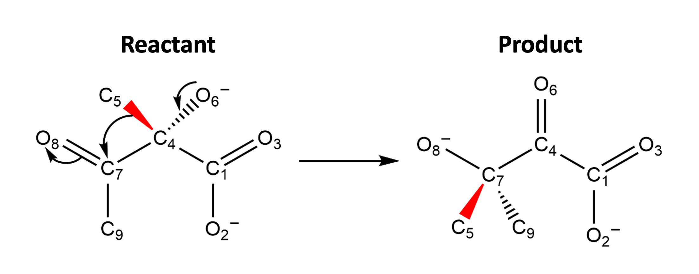

# Demonstration of `dl_kcat` data and model training

The purpose of this folder is to demonstrate how to use the scripts in the `dl_kcat` repo. 

Follow along in `demo.ipynb`, or download and view `demo.html` in a browser, to:
* Learn how to access and work with the data
* Learn how to train a model for two different learning tasks
* Understand the different options and parameters when training models

In brief, the purpose of the scripts in `dl_kcat` is to train deep learning models to predict an enzyme mutant's specific activity based on its pre-reaction structural dynamics. The structural dynamics are captured by a set of manually engineered features (interatomic distances, angles, and torsions) that collectively describe the structure of the active site over some time interval. Therefore, the data are a multivariate time series comprised of 70 features and typically 30+ time points. These time series are drawn from molecular dynamics simulations of attempted reactions, which were sampled using [transition interface sampling (TIS)](https://pubs.aip.org/aip/jcp/article/118/17/7762/185320/A-novel-path-sampling-method-for-the-calculation).

The reaction that we simulate is a methyl transfer:

Note that $C_{5}$ is originally bound to $C_{4}$ in the reactant, but it is transfered during the reaction and bound to $C_{7}$ in the product.

We use TIS to collect examples of both successful, as well as failed, attempted reactions by the enzyme.

### Here is a successful reaction:
Substrate is shown in light orange. NADPH is light purple. Mg ions are shown as white spheres with their coordinating waters in stick representation. The enzyme is shown in light gray.

### Here is a failed reaction:

Note that $C_{5}$ makes significant progress toward the left, before hitching and ultimately returning to its starting point bound to $C_{4}$. 

Having seen the entire gif, it's obvious whether an attempted reaction was successful in reaching the product well or not, because we can see the position of $C_{5}$ at the end point. But, what if we were only given data *prior* to the initiation of the attempted reaction? It turns out that the differences between successful and failed simulations, in this pre-reaction interval, are very subtle -- not that easy to see in the above gifs. Nonethess, machine learning models are very accurate in predicting whether a forthcoming attempt will be successful or not, and you can train a model in `demo.ipynb` to show this. This implies that there are structural characteristics that associate with successful vs. failed reaction attempts. Do these kinds of structural characteristics directly relate to overall catalytic activity? We show how to train a model to predict activity from pre-reaction structural dynamics in `demo.ipynb` as well. It is this learning task that the `dl_kcat` repo was primarily created for. 